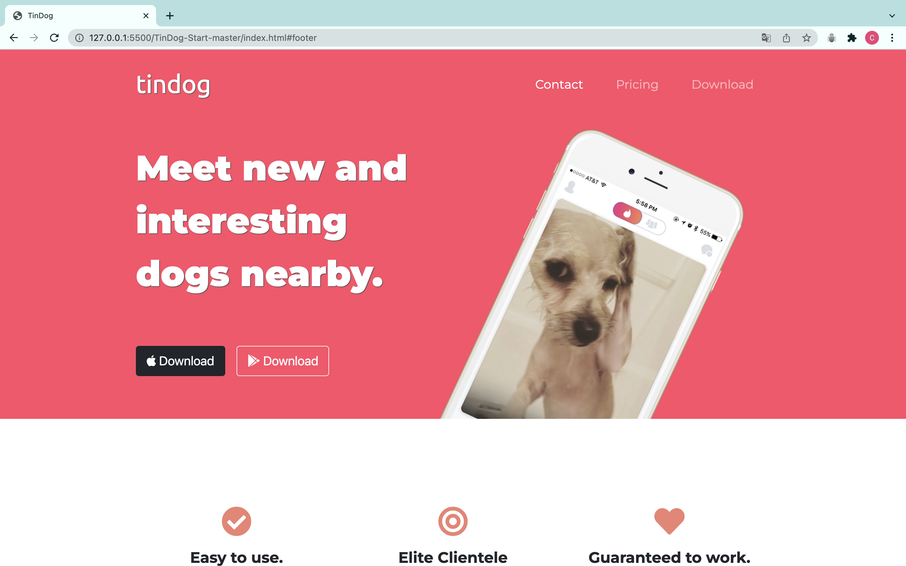

# TinDog

This is a solution to the TinDog. A challenge from The Complete 2022 Web Development Bootcamp, Udemy course of Dr. Angela Yu.

## Table of contents

- [Overview](#overview)
  - [The challenge](#the-challenge)
  - [Screenshot](#screenshot)
  - [Links](#links)
- [My process](#my-process)
  - [Built with](#built-with)
  - [What I learned](#what-i-learned)
  - [Continued development](#continued-development)
- [Author](#author)

## Overview

### The challenge

Users should be able to:

- View the optimal layout depending on their device's screen size
- Use Bootstrap

### Screenshot

### Links

- [Solution URL](https://github.com/claurey/tindog)
- [Live Site URL](https://claurey.github.io/tindog/)

## My process

### Built with

- Semantic HTML5 markup
- CSS custom properties
- Bootstrap
- Media Queries

### What I learned

I learned to use Bootstrap.

## Author

- Website - [https://claurey.github.io](https://claurey.github.io)
- Twitter - [@claurey591](https://www.twitter.com/claurey591)

